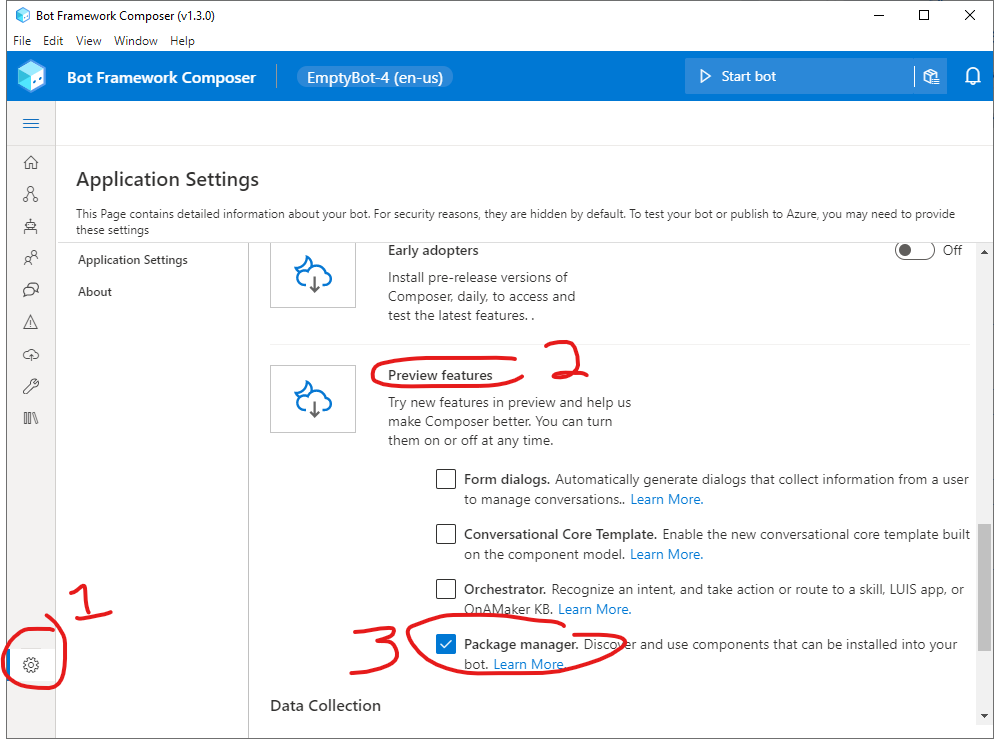
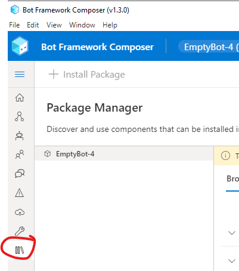
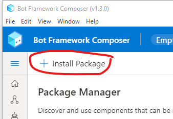
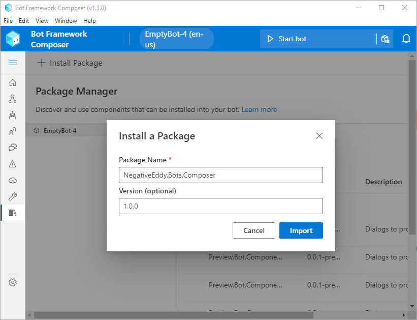

# bfcomposerhelpers
[Custom Actions](https://docs.microsoft.com/en-us/composer/how-to-add-custom-action) for [Bot Framework Composer](https://aka.ms/composer)

## Actions available

### Cosmos DB Query
Queries an [Azure Cosmos DB](https://azure.microsoft.com/en-us/services/cosmos-db/) database

### Cosmos DB Upsert
Inserts or updates a document in an [Azure Cosmos DB](https://azure.microsoft.com/en-us/services/cosmos-db/) database

### Publish Event Grid Event

Publishes an event to an [Azure Event Grid](https://azure.microsoft.com/en-us/services/event-grid/) topic

### Hello World
A simple action which requires no parameters and just sends "Hello World!" to the user. This can be used to test that the library is properly installed into your Composer bot.

## Installation

3. Open your bot in Composer
4. Eject the Runtime if you have not done so already (C# version) 
6. Enable the Package Manager feature in the Preview features section of the application settings page
   
   .

7. Go to the package manager page of Composer
  
  

8. Click Install Package
   
   

9. Enter "NegativeEddy.Bots.Composer" as the package name in the dialog and enter a version

    

10. Click Import (composer may take a while to process this step)

**NOTE:** At this point you can start using the actions in the designer but the bot will fail if you try to run it with the actions in place.

11. Open the file in your bots directory .\runtime\azurewebapp\Startup.cs and make the following changes
12. add a using statement at the top
````
using NegativeEddy.Bots.Composer.Actions;
````

13. Find the section in the Startup() method where that looks like this 

````
            // register components.
            ComponentRegistration.Add(new DialogsComponentRegistration());
            ComponentRegistration.Add(new DeclarativeComponentRegistration());
            ComponentRegistration.Add(new AdaptiveComponentRegistration());
            ...
````

   and add this line

````
        ComponentRegistration.Add(new NegativeEddyActionComponentRegistration());
````

Now the runtime is ready, add some actions and try it out!!!
